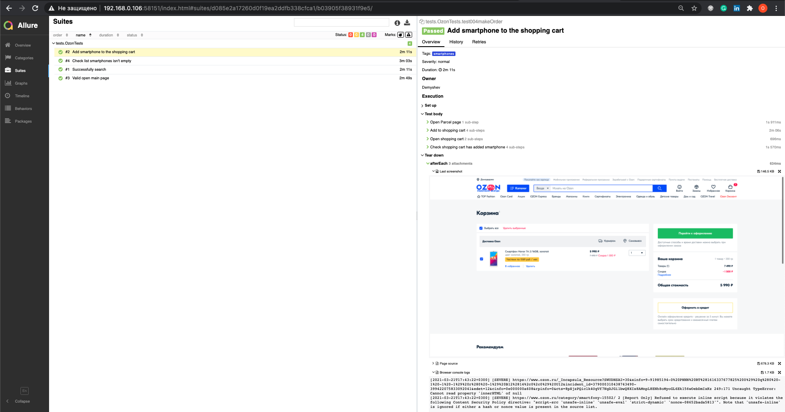
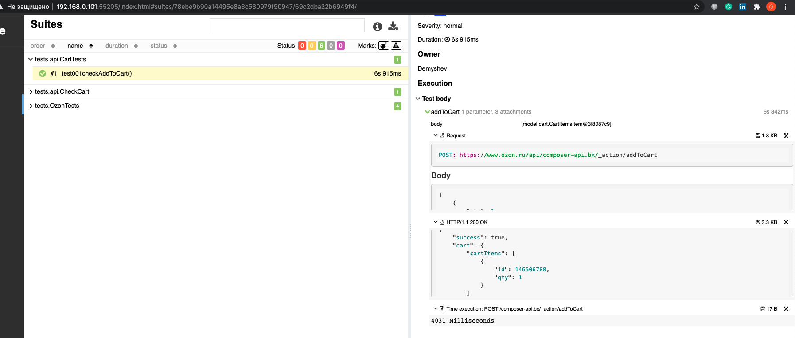

# Autotests for ozon.ru

## Technology stack
Java, Gradle, Junit5, Selenide, Allure Report, Telegram Bot.

## Run tests with use terminal:

### For run local tests need fill example.properties file and call command:

> gradle test (name task)

### For run remote tests need fill example.properties or to pass value:

* remote.driver.url (url address from selenoid or grid)
* remote.driver.user (name user if required for available to selenoid/grid)
* remote.driver.password (password user if required for available to selenoid/grid)
* remote.browser.name (chrome, firefox)
* base.url (stand)
* video (boolean true or false)
* threads (number of threads, default 2)

> gradle clean -Dremote.driver.url= -Dremote.driver.user= -Dremote.driver.password= -Dremote.browser.name= -Dbase.url= -Dvideo= -Dthreads=

#### Allure report

